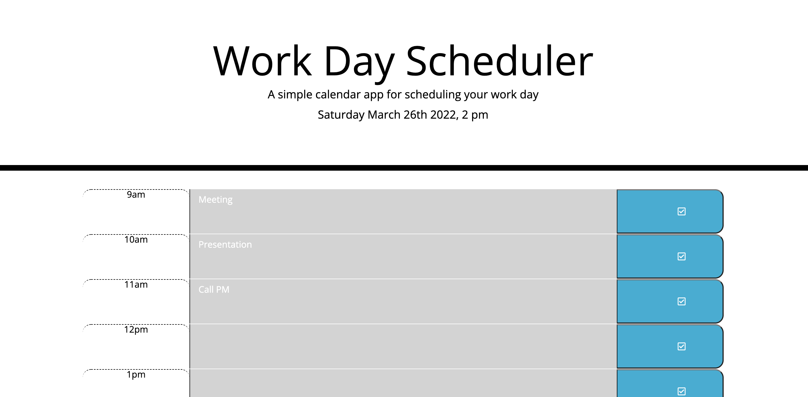
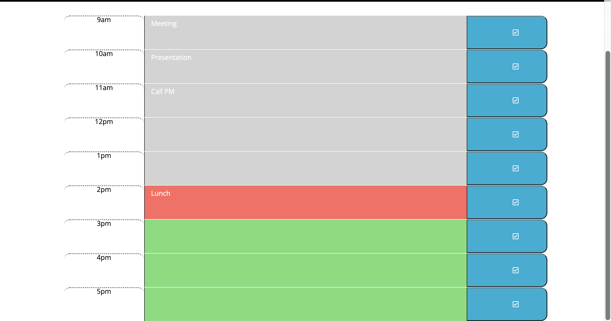

# My Scheduler

My scheduler will let users plan their day with day displayed on top of the planner and will highlight tasks based on red for current, grey for past and green future. Once tasks are saved user can return to the same tasks without loosing them.

# Live site

https://katochsenthal.github.io/myScheduler/

# Preview

;
;

# Technologies Used

- HTML
- CSS
- JAVASCRIPT
- BOOTSTRAP

# Starter Code

Starter code provided for Xander Rapstine

# Credits

For Javascript and functionality Senthol
